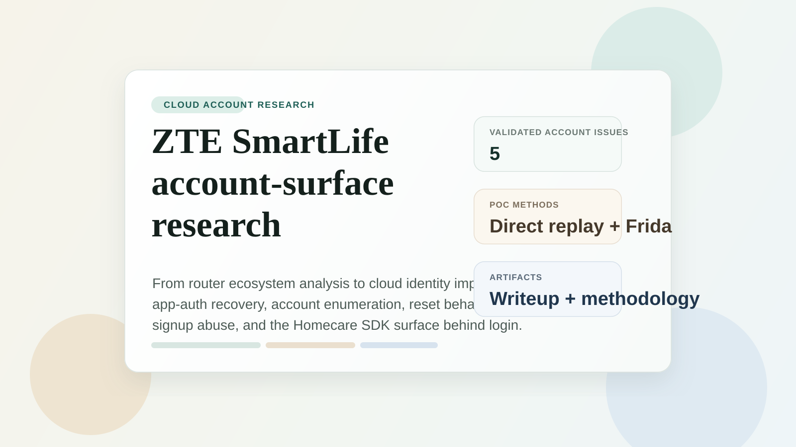
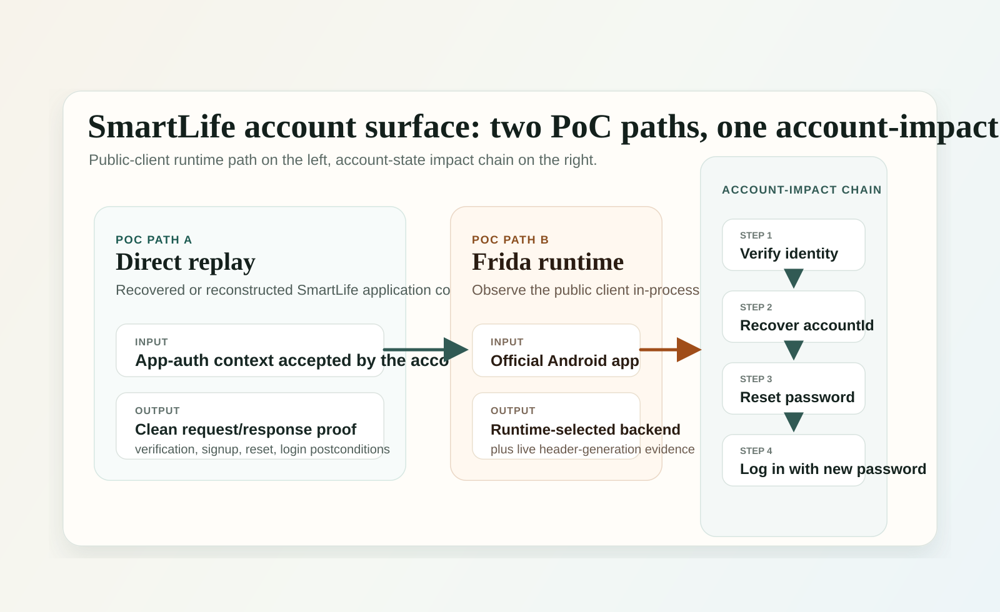

# ZTE SmartLife Security Findings

<p align="center">
  
</p>

<p align="center">
  Public technical writeup and PoC methodology for a SmartLife account-layer investigation that moved from ZTE router ecosystem research into the SmartLife cloud identity surface.
</p>

<p align="center">
  <a href="index.html"><strong>Read the article</strong></a>
  ·
  <a href="pocs/README.md"><strong>PoC methods</strong></a>
</p>

## At a glance

- Surface: SmartLife account backend reached by the public Android client
- Focus: app-auth trust recovery, account enumeration, password reset, signup behavior, and post-login Homecare SDK reach
- Validation model: researcher-controlled accounts plus runtime observation of the public client
- Output here: public writeup and public-safe methodology notes

## Why this repo exists

This repository is the publication-side package for a SmartLife account-surface case that started during ZTE H188A/H288A ecosystem research.

The core result was not just client-side secret exposure. The interesting part was what the backend accepted once the SmartLife application context was reconstructed or observed:

1. account existence and backend identifier disclosure
2. password reset behavior that changed account state
3. immediate login with the attacker-set password
4. signup behavior that allowed email identity reservation before mailbox ownership was proven

The writeup also maps the larger Homecare SDK surface sitting behind the same SmartLife session boundary.

## Included in this repo

### 1. Long-form article

- [index.html](index.html)

This is the main artifact. It is written as a technical post-release disclosure article rather than a case-notes dump.

### 2. Local assets

- `writeup-assets/`

These are the images referenced by the article and repo landing page.

### 3. PoC suites & automation

- [pocs/README.md](pocs/README.md)

The PoC directory provides standalone replay automation scripts, Frida in-process instrumentation hooks, and production probe utilities.

## Verified issue set covered by the article

| ID | Finding | Notes |
| --- | --- | --- |
| 1 | Forged SmartLife app-auth via public bootstrap and recoverable client trust | Entry point into the account surface |
| 2 | Account enumeration and backend accountId disclosure | Identity oracle on the account layer |
| 3 | Password reset without verification code | Account state change followed by successful login |
| 4 | Account deletion behavior on the earlier runtime-selected path | Later runtime path diverged and returned token-check failure |
| 5 | Arbitrary email pre-registration / account squatting | Email identity reservation before mailbox ownership was proven |

## Visual map

<p align="center">
  
</p>

## PoC method split

Two validation paths mattered in this case.

### Direct replay

- shows the account lifecycle behavior end to end
- produces the clearest state-change and login postconditions
- maps cleanly to the account-takeover section of the article

See [pocs/direct-replay/README.md](pocs/direct-replay/README.md).

### Frida runtime observation

- observes the public client in-process
- shows which backend path the app selected
- shows where the account-authentication material was built at runtime

See [pocs/frida/README.md](pocs/frida/README.md).

### Runtime-path retest

- separates the later public-client path from the earlier delete-path behavior
- keeps the environment story technically clean

See [pocs/runtime-path-probes/README.md](pocs/runtime-path-probes/README.md).

## Suggested reading order

1. Start with [index.html](index.html).
2. Then read [pocs/README.md](pocs/README.md).
3. Use the method-specific notes as the map back to the broader private lab archive if needed.

## Repo shape

```text
.
|-- index.html
|-- README.md
|-- pocs/
|   |-- README.md
|   |-- direct-replay/
|   |-- frida/
|   `-- runtime-path-probes/
`-- writeup-assets/
```

## Public disclosure status

Following coordinated disclosure with ZTE PSIRT, complete remediation across cloud backends, and key rotation, this repository publishes the full technical writeup, PoC suites, and cryptographic analysis.
